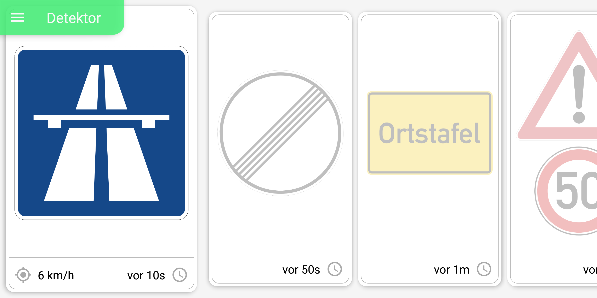

# Signapse Road Sign Recognition


This repository contains the source code for the [Signapse App](https://signapse.app). Signapse is an Android App for realtime recognition of german road signs. Originally developed in 2017 using early versions of TensorFlowLite. The processing of camera images was implemented in C++ for performance reasons. 


**Code Quality**
The code is 100% complete and fully commented using doxygen. You can generate the documentation using generate_docs.bat.

**Purpose**
The purpose of this application is to detect german road signs from an incoming camera image stream on smartphones. For this, the smartphone has to be mounted on the wind shield ensuring the camera has an unobstructed view of the road ahead. Images are analyzed with a frequency of ~10FPs. In a first step, a detector (based on SSDLite) identifies all signs on the camera image and extracts a bounding box for each. Each detected sign is subsequently analyzed separately by a classificator (based on MobileNetV2). Lastly, signs on the same pole will be grouped together and displayed in the application. Based on the detected sign, the App identifies the current speed limit and triggers a warning when overspeeding.



#### Installing the current version from PlayStore

1. Checkout Signapse on [Google Playstore](https://play.google.com/store/apps/details?id=de.swp.tsd.trafficsigndetection) 
2. Install App


#### Build App using Android Studio

1. Clone git repository:
```bash
git clone https://github.com/RealLast/Signapse.git
```
2. Install Android NDK >= 15 && <= 21
2. Build C++ RoadSignAPI (check next section)

## Compiling the RoadSignAPI (C++)
To build the Signapse App, you first have to build the RoadSignAPI. The RoadSignAPI is written in C++ and incorporates highly efficient preprocessing of camera images using OpenCV, and hardware-accelerated model inference using TensorFlowLite. 

You require Ubuntu or another x86_64 Linux distribution. For building, we use CMake. The RoadSignAPI were tested under Ubuntu 18.04, 17.10, 16.10 and 16.04.


Using the terminal, navigate into the folder "RoadSignAPI_Standalone_Tensorflow" and execute the following:
```bash
cmake .
```

This creates a make file for compiling the project. You can execute it as follows:
```bash
make all
```
After successfully compiling the RoadSignAPI, you can open the App project in Android studio and compile it.


## Neural Networks

### Detection

Detailed instructions on how to train and export the road sign detection model (SSDLite) can be found in the [Readme of the MLModels subdirectory](MLModels/Detection/ReadMe.md) (instructions in german).

### Classification

To train the classifier, execute the script [`MLModels/Classification/mobilenetv2.py`](MLModels/Classification/mobilenetv2.py).

At the top of the script, you can find some parameters that you need to adapt.
The most important ones are the following, which indicate the path to train and validation data.
```bash
train_data_path = ’/datasets/swp2018/split_img/train’ 
validation_data_path = ’/datasets/swp2018/split_img/validation’
```


You can also change the number of files to train on, image size and classes.

```bash
file_count_train = 134443 
image_size = 96 
classes = 47
```

You can also specify the following hyperparemeters.
```bash
epochs = 200 
batch_size = 128 
learn_rate = 0.045 
decay = 0.00004 
momentum = 0.9
```

To use the model in the App, you have to freeze it and convert to protobuf. You can use the script under [`MLModels/Classification/keras_to_tensorflow.py`](MLModels/Classification/keras_to_tensorflow.py) like the following:
```bash
python keras_to_tensorflow.py -input_model weights.hdf5
```
Here, weights.hdf5 means the trained and saved keras weights. After executing the script, you will find a .pb file in the same folder, which you can copy to the assets folder of the App.


## Contributors

* Patrick Langer
* Söhnke Fischedick
* Robert Bock
* Florian Köhler
